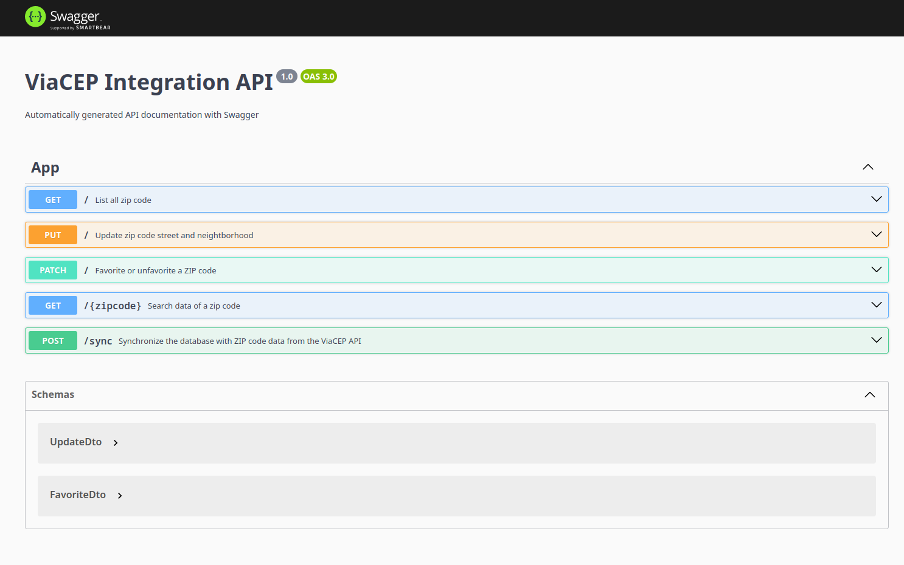

[circleci-image]: https://img.shields.io/circleci/build/github/nestjs/nest/master?token=abc123def456
[circleci-url]: https://circleci.com/gh/nestjs/nest

<p align="center">
  
  &nbsp;&nbsp;&nbsp;&nbsp;
  
</p>

<h1 align="center">ViaCEP Integration API</h1>

<p align="center">
<a href="https://www.npmjs.com/~nestjscore" target="_blank"></a>
<a href="https://circleci.com/gh/nestjs/nest" target="_blank"></a>
<a href="https://coveralls.io/github/nestjs/nest?branch=master" target="_blank"></a>

</p>

## Description

This project provides integration with the ViaCEP API using NestJS and MongoDB, enabling address lookup, storage, and management based on Brazilian postal codes (CEPs).

---

## Tech Stack

- **NestJS** – TypeScript-based progressive Node.js framework  
- **MongoDB** – NoSQL database for document-based storage  
- **Mongoose** – ODM for MongoDB integration  
- **Swagger** – Auto-generated API docs  
- **Docker Compose** – Simplified container orchestration for multi-container applications  
- **TypeScript** – JavaScript with strong typing for better developer experience

---

## Start database

```bash
$ docker compose up -d
```

## Install depencencies

```bash
$ pnpm install
```

## Run

```bash

$ pnpm run start
# or
$ pnpm run start:dev

```

## Run tests

```bash

# tests
$ pnpm test

# coverage
$ pnpm test:cov

```

## Swagger

```bash
# url
$ http://localhost:3000/docs

```


## ⚠️ Important Notice

> Before using the API to fetch address data, you must first synchronize the local database by making a `POST` request to the `/sync` endpoint.  
>  
> This step populates the database with ZIP code (CEP) data retrieved from the ViaCEP API.  
>  
> **Endpoint:**  
> `POST /sync`


## Code Coverage


